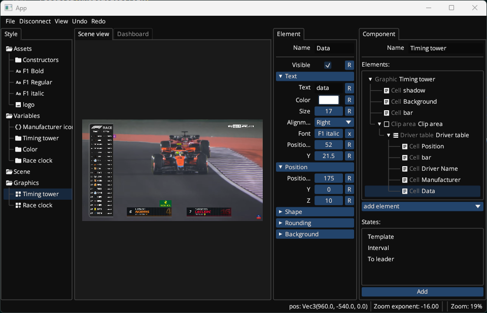
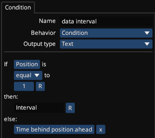

# Timing Tower

This is a work in progress application to generate live streaming graphics for simracing games in form of an overlay.

The overlay is rendered as a website which allows you to include it in a stream using simple browser source. The website is hosted by the controller application which also connects to the game and extracts the necessary information from it.

The visual appearance of the overlay is defined in a style definition file which stores the overlay in a json format. The editor application is used to edit this style definition file.

## Editor
The editor is used to change every aspect of the overlay.

It also allows for the creation of simple conditional variables that dynamically change the appearance of the overlay.

## Overlay
The styling allows for a great deal of customization to create an overlay that is fitting for the stream. Many of the most popular motorsports overlay can be easily recreated using the editor.

### GTWC
The GTWC overlay can be recreated in great detail.
Left is the original and the recreation is on the right side.

### Formula 1
The Formula 1 overlay can also be recreated to a large extend but minor details are missing.
Again, left is original and right is recreation.

